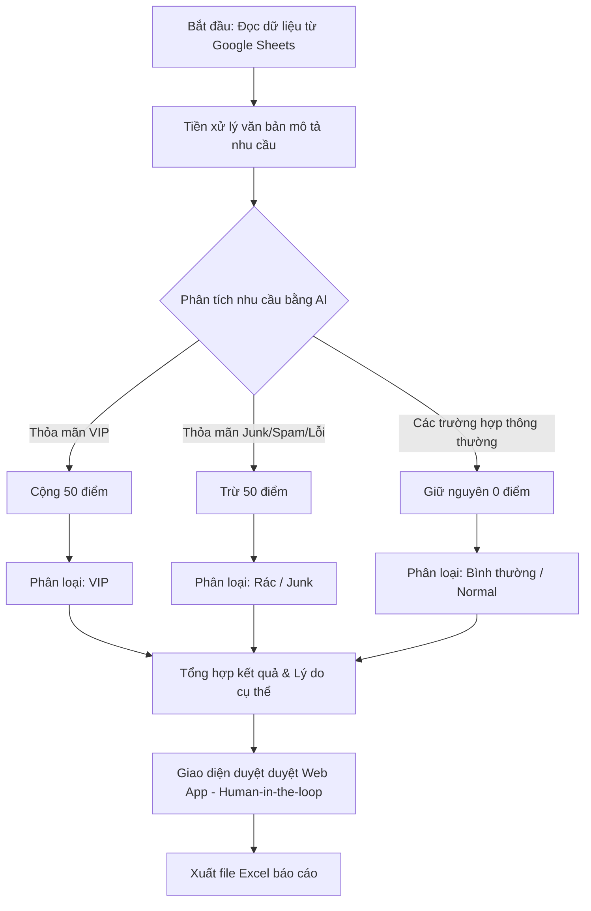

# Lead Scoring Skill - Ngành Bất Động Sản

Tài liệu này hướng dẫn và định nghĩa các quy tắc để hệ thống AI tự động chấm điểm, phân loại và phân tích tiềm năng của khách hàng (lead scoring) từ danh sách liên hệ thu thập qua Google Sheets.

---

## 1. Cấu Trúc Dữ Liệu Đầu Vào

Dữ liệu khách hàng được cung cấp dưới dạng bảng (hoặc CSV từ Google Sheets) với các cột chính sau:
- **`id`**: Mã định danh duy nhất của khách hàng (số nguyên).
- **`ten_khach`**: Họ và tên khách hàng.
- **`sdt`**: Số điện thoại liên hệ.
- **`nhu_cau_mo_ta`**: Đoạn văn bản mô tả nhu cầu, mong muốn, ngân sách, vị trí hoặc tình trạng liên lạc của khách hàng.

---

## 2. Tiêu Chí Chấm Điểm & Phân Phân Loại Chi Tiết

Hệ thống chấm điểm sẽ bắt đầu từ mức điểm mặc định là **0 điểm**. AI sẽ phân tích nội dung cột `nhu_cau_mo_ta` để áp dụng các quy tắc cộng/trừ điểm và xếp loại khách hàng theo ba nhóm:

### 2.1. Nhóm VIP / Siêu Tiềm Năng (Cộng 50 Điểm)
**Điều kiện xếp loại**: Điểm số đạt từ **+50 điểm** trở lên.
AI cần nhận diện các từ khóa, cụm từ đồng nghĩa hoặc ngữ cảnh sau trong mô tả nhu cầu để cộng điểm:

*   **Ngân sách lớn**: 
    *   Đề cập số tiền cụ thể từ **20 tỷ VNĐ trở lên** (ví dụ: *"ngân sách trên 30 tỷ"*, *"tài chính 25 tỷ"*).
    *   Các cụm từ chỉ khả năng tài chính mạnh mẽ: *"tài chính mạnh"*, *"ngân sách không thành vấn đề"*, *"thanh toán thẳng"*, *"tài chính cực mạnh"*.
*   **Loại hình bất động sản cao cấp**:
    *   Nhà ở/Nghỉ dưỡng hạng sang: *"Biệt thự đơn lập"*, *"Penthouse"*, *"Biệt thự ven sông"*.
    *   Bất động sản thương mại/công nghiệp quy mô lớn: *"Shophouse mặt đường lớn"*, *"Quỹ đất công nghiệp"*, *"Sàn văn phòng diện tích lớn"* (hoặc trên 2000m²).
*   **Vị trí đắc địa / Khu vực cao cấp**:
    *   Khu vực trung tâm hoặc đại đô thị lớn: *"Quận 1"*, *"Ven sông"*, *"Vinhomes Ocean Park"*, *"Phú Mỹ Hưng"*, *"khu Đông"*.
*   **Đối tượng khách hàng cao cấp**:
    *   Có thông tin định danh: *"Chủ doanh nghiệp"*, *"Nhà đầu tư chuyên nghiệp"*.
    *   Hành vi mua sỉ hoặc số lượng lớn: *"Mua sỉ"*, *"Mua số lượng lớn"*, *"gom sỉ 5-10 căn"*.
*   **Tính cấp thiết & Yêu cầu pháp lý cao**:
    *   Pháp lý minh bạch: *"Pháp lý chuẩn 100%"*, *"Sổ hồng riêng"*.
    *   Giao dịch trực tiếp: *"Muốn gặp trực tiếp chủ đầu tư để đàm phán"*, *"cần gặp trực tiếp giám đốc dự án"*.

**Ví dụ thực tế từ dữ liệu**:
> *   **Khách hàng**: `Trần Hoàng Dũng` (SĐT: `943392982`)
>     *   *Mô tả*: "Chủ doanh nghiệp lớn, cần tìm quỹ đất công nghiệp hoặc sàn văn phòng diện tích trên 2000m2 tại khu Đông. Tài chính cực mạnh, yêu cầu pháp lý chuẩn 100%."
>     *   *Đánh giá*: VIP (+50 điểm) - Thỏa mãn tiêu chí chủ doanh nghiệp, quỹ đất công nghiệp/sàn văn phòng lớn, tài chính cực mạnh, pháp lý 100%.
> *   **Khách hàng**: `Bùi Phương Tâm` (SĐT: `790240040`)
>     *   *Mô tả*: "Khách hàng VIP, quan tâm biệt thự đơn lập phân khu cao cấp nhất. Ngân sách trên 30 tỷ, thanh toán thẳng. Yêu cầu vị trí ven sông, hướng Đông Nam. Đã từng mua nhiều dự án của tập đoàn."
>     *   *Đánh giá*: VIP (+50 điểm) - Thỏa mãn biệt thự đơn lập, ngân sách trên 30 tỷ, vị trí ven sông.

---

### 2.2. Nhóm Rác / Không Tiềm Năng (Trừ 50 Điểm)
**Điều kiện xếp loại**: Điểm số đạt từ **-50 điểm** trở xuống.
AI cần nhận diện các dấu hiệu thiếu nghiêm túc, không khớp ngành hoặc thông tin liên lạc bị lỗi để trừ điểm:

*   **Yêu cầu phi thực tế**:
    *   Tìm mua bất động sản với giá thấp vô lý so với thị trường thực tế (ví dụ: *"nhà Quận 1 giá 1-2 tỷ"*, *"nhà trung tâm có sân vườn hồ bơi giá vài trăm triệu"*, *"tìm nhà thuê nguyên căn giá 2 triệu ở trung tâm thành phố"*).
*   **Không có nhu cầu thực tế**:
    *   Thông tin sai lệch: *"Nhầm số"*, *"Không có nhu cầu"*, *"Dữ liệu cũ"*, *"Nhầm ngành"*.
*   **Khách hàng không thiện chí**:
    *   Thái độ thiếu hợp tác hoặc hỏi không mục đích: *"Hỏi giá cho vui"*, *"Chưa có ý định mua trong năm nay"*, *"Thái độ không hợp tác khi tư vấn"*.
*   **Spam / Quảng cáo ngược**:
    *   Nội dung quảng bá các dịch vụ khác thay vì mua/thuê bất động sản: *"Bảo hiểm"*, *"Vay vốn"*, *"Mời chào dịch vụ"*, *"quảng cáo ngược lại dịch vụ bảo hiểm"*.
*   **Thông tin liên lạc lỗi**:
    *   Không liên lạc được: *"Thuê bao"*, *"Gọi nhiều lần không bắt máy"*, *"Không phản hồi Zalo"*.

**Ví dụ thực tế từ dữ liệu**:
> *   **Khách hàng**: `Hồ Hồng Linh` (SĐT: `848475144`)
>     *   *Mô tả*: "Khách hàng nhầm số, không có nhu cầu về bất động sản. Có vẻ là dữ liệu cũ từ ngành khác trộn vào."
>     *   *Đánh giá*: Junk (-50 điểm) - Không có nhu cầu, nhầm số.
> *   **Khách hàng**: `Lê Phương Nam` (SĐT: `389404152`)
>     *   *Mô tả*: "Tìm nhà thuê nguyên căn giá 2 triệu ở trung tâm thành phố. Yêu cầu phi thực tế, thái độ không hợp tác khi tư vấn."
>     *   *Đánh giá*: Junk (-50 điểm) - Yêu cầu phi thực tế, thái độ không hợp tác.
> *   **Khách hàng**: `Hồ Đức Lan` (SĐT: `991102318`)
>     *   *Mô tả*: "Spam, gọi điện đến chỉ để quảng cáo ngược lại dịch vụ bảo hiểm."
>     *   *Đánh giá*: Junk (-50 điểm) - Spam quảng cáo dịch vụ bảo hiểm.

---

### 2.3. Nhóm Khác / Tiềm Năng Trung Bình (Giữ Nguyên Điểm Hoặc Điểm Trung Bình)
**Điều kiện xếp loại**: Điểm số đạt **0 điểm** (hoặc dao động từ -40 đến +40 nếu áp dụng chấm điểm chi tiết).
Các trường hợp khách hàng có nhu cầu thực tế nhưng thuộc phân khúc trung bình hoặc cần tư vấn thêm:

*   Khách hàng tìm mua chung cư, nhà phố tầm trung (tài chính dao động từ **3 tỷ đến dưới 20 tỷ**).
*   Khách hàng cần hỗ trợ tài chính: *"vay ngân hàng"*, *"cần hỗ trợ vay ngân hàng 70%"*, *"đang cân nhắc chính sách"*.
*   Khách hàng có nhu cầu thực tế nhưng cần tư vấn thêm về mặt pháp lý, chính sách chiết khấu, vị trí, hoặc muốn đi xem nhà mẫu.
*   Thuê mặt bằng thương mại tầm trung (ví dụ: *"thuê mặt bằng spa Quận 1 dưới 50 triệu/tháng"*).
*   Khách hàng mua đất nền vùng ven (Long An, Đồng Nai) để đầu tư với ngân sách vừa phải (2-3 tỷ).

**Ví dụ thực tế từ dữ liệu**:
> *   **Khách hàng**: `Lý Đức Cường` (SĐT: `953430096`)
>     *   *Mô tả*: "Quan tâm căn hộ 2PN tại Quận 7 cho gia đình trẻ. Tài chính khoảng 4-5 tỷ, cần hỗ trợ vay ngân hàng 70%. Muốn đi xem nhà mẫu vào cuối tuần này."
>     *   *Đánh giá*: Normal (0 điểm) - Nhu cầu căn hộ tầm trung (4-5 tỷ), cần vay ngân hàng.
> *   **Khách hàng**: `Phan Văn Hoa` (SĐT: `894782782`)
>     *   *Mô tả*: "Đang tìm thuê mặt bằng kinh doanh spa tại Quận 1, diện tích khoảng 80-100m2. Giá thuê mong muốn dưới 50 triệu/tháng. Cần ký hợp đồng dài hạn."
>     *   *Đánh giá*: Normal (0 điểm) - Thuê mặt bằng spa trung bình, không thuộc VIP (không đề cập ngân sách lớn mua bán/VIP).

---

## 3. Quy Trình Xử Lý Hệ Thống (Workflow)

Để xây dựng một quy trình tự động hóa chấm điểm khách hàng, AI cần thực hiện theo các bước sau:



1.  **Đọc Dữ Liệu**: Tải dữ liệu thô từ Google Sheets.
2.  **Chấm Điểm & Phân Loại Bằng AI**: Gửi từng yêu cầu sang mô hình ngôn ngữ lớn (LLM) kèm theo prompt chấm điểm được cấu hình sẵn.
3.  **Kiểm Duyệt Kết Quả (Human-in-the-loop)**: Cung cấp giao diện Web App cho nhân sự bán hàng (Sales/Admin) xem xét, chỉnh sửa trực tiếp điểm số và trạng thái nếu cần thiết.
4.  **Xuất File Excel**: Xuất toàn bộ dữ liệu đã được chấm điểm và phê duyệt ra file Excel (`.xlsx`) để bàn giao cho đội ngũ tư vấn.

---

## 4. Prompt Template Mẫu Dành Cho AI Chấm Điểm

Dưới đây là prompt mẫu có cấu trúc tối ưu để gửi cho mô hình ngôn ngữ lớn (ví dụ: Gemini 1.5/2.0/3.5) thực hiện chấm điểm:

```markdown
Bạn là chuyên gia phân tích dữ liệu và chấm điểm khách hàng tiềm năng (Lead Scoring) trong ngành Bất Động Sản.
Nhiệm vụ của bạn là đọc thông tin nhu cầu khách hàng dưới đây và đưa ra:
1. Điểm số (Dựa trên thang điểm khởi đầu là 0):
   - Cộng 50 điểm (+50) nếu có các dấu hiệu của khách hàng VIP/Siêu tiềm năng (Ngân sách lớn >= 20 tỷ, tài chính cực mạnh, loại hình cao cấp như biệt thự đơn lập/penthouse/quỹ đất lớn, vị trí đắc địa Vinhomes/Q1/Phú Mỹ Hưng, đối tượng chủ doanh nghiệp/mua sỉ/gom số lượng lớn, yêu cầu pháp lý chuẩn/sổ hồng riêng/gặp trực tiếp đàm phán).
   - Trừ 50 điểm (-50) nếu có các dấu hiệu khách hàng rác/không tiềm năng (Yêu cầu phi thực tế như mua nhà trung tâm giá 1-2 tỷ, không có nhu cầu/nhầm số/dữ liệu cũ, không thiện chí/hỏi giá cho vui/thái độ không hợp tác, spam/mời chào bảo hiểm/vay vốn, thông tin liên lạc bị thuê bao/không nghe máy/không phản hồi Zalo).
   - Điểm bằng 0 nếu thuộc các trường hợp thông thường (chung cư, đất nền vùng ven 2-3 tỷ, nhà phố 3-10 tỷ, thuê mặt bằng trung bình, có vay ngân hàng, cần tư vấn thêm).
2. Phân loại (VIP, Bình thường, Rác).
3. Lý do chấm điểm ngắn gọn, súc tích bằng tiếng Việt.

Thông tin khách hàng cần chấm điểm:
- Tên khách: {ten_khach}
- Mô tả nhu cầu: {nhu_cau_mo_ta}

Hãy trả về kết quả dưới dạng JSON có cấu trúc như sau:
{
  "diem": [Điểm số: 50, 0, hoặc -50],
  "phan_loai": "[VIP / Binh thuong / Rac]",
  "ly_do": "[Giải thích chi tiết lý do chấm điểm và nhận diện từ khóa/ngữ cảnh]"
}
```

---

## 5. Hướng Dẫn Code Python Demo Tích Hợp

Đoạn code Python dưới đây minh họa cách đọc từ file Excel/CSV, gọi API chấm điểm và lưu kết quả:

```python
import pandas as pd
import google.generativeai as genai
import json

# Cấu hình API Gemini
genai.configure(api_key="YOUR_GEMINI_API_KEY")
model = genai.GenerativeModel('gemini-1.5-flash')

# 1. Đọc dữ liệu từ file CSV tải về từ Google Sheets
df = pd.read_csv("danh_sach_khach_hang.csv")

def score_lead(row):
    prompt = f"""
    Hãy chấm điểm khách hàng bất động sản sau dựa trên quy tắc:
    - Cộng 50 điểm nếu là khách VIP/Tài chính cực mạnh (mua sỉ, biệt thự, penthouse, đất công nghiệp, ngân sách >20 tỷ).
    - Trừ 50 điểm nếu là khách Rác/Spam/Thuê bao/Hỏi giá cho vui/Yêu cầu phi thực tế (nhà Q1 giá 1 tỷ).
    - Giữ nguyên 0 điểm nếu là nhu cầu mua chung cư, đất nền vùng ven, nhà phố tầm trung 3-10 tỷ, cần vay ngân hàng.
    
    Khách hàng: {row['ten_khach']}
    Nhu cầu: {row['nhu_cau_mo_ta']}
    
    Hãy trả về JSON:
    {{
      "diem": int,
      "phan_loai": str,
      "ly_do": str
    }}
    """
    try:
        response = model.generate_content(
            prompt,
            generation_config={"response_mime_type": "application/json"}
        )
        result = json.loads(response.text)
        return result['diem'], result['phan_loai'], result['ly_do']
    except Exception as e:
        return 0, "Bình thường", f"Lỗi khi xử lý: {str(e)}"

# 2. Áp dụng chấm điểm hàng loạt
scores = []
classes = []
reasons = []

for idx, row in df.iterrows():
    diem, phan_loai, ly_do = score_lead(row)
    scores.append(diem)
    classes.append(phan_loai)
    reasons.append(ly_do)

df['diem'] = scores
df['phan_loai'] = classes
df['ly_do_chi_tiet'] = reasons

# 3. Xuất file Excel báo cáo cuối cùng
df.to_excel("ket_qua_lead_scoring.xlsx", index=False)
print("Đã hoàn thành chấm điểm và xuất file kết quả!")
```
